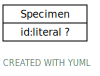

# Type: Specimen

-> Any material sample taken from a biological entity (living or dead), or taken from a physical object or the environment. (Adapted from FHIR) Specimens are usually collected as an example of their kind, often for use in some investigation.

URI: [specimen:Specimen](https://ccdh.org/specimen/Specimen)

## Referenced by class

## Attributes

### Own

 * [Specimen➞id](Specimen_id.md)  OPT
    * Description: -> The 'logical' identifier of the entity in the system of record, e.g. a UUID. This 'id' is unique within a given system. The identified entity may have a different 'id' in a different system.
    * range: [Literal](types/Literal.md)
